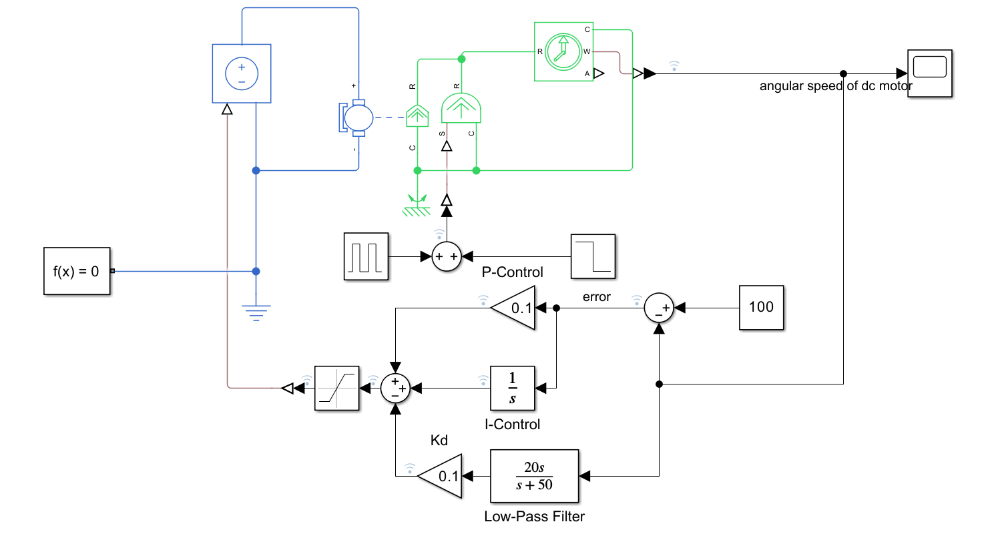
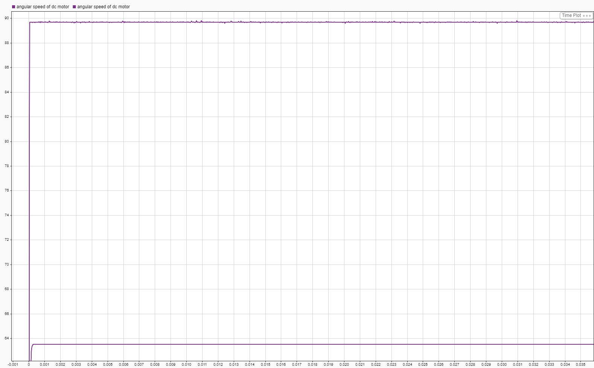
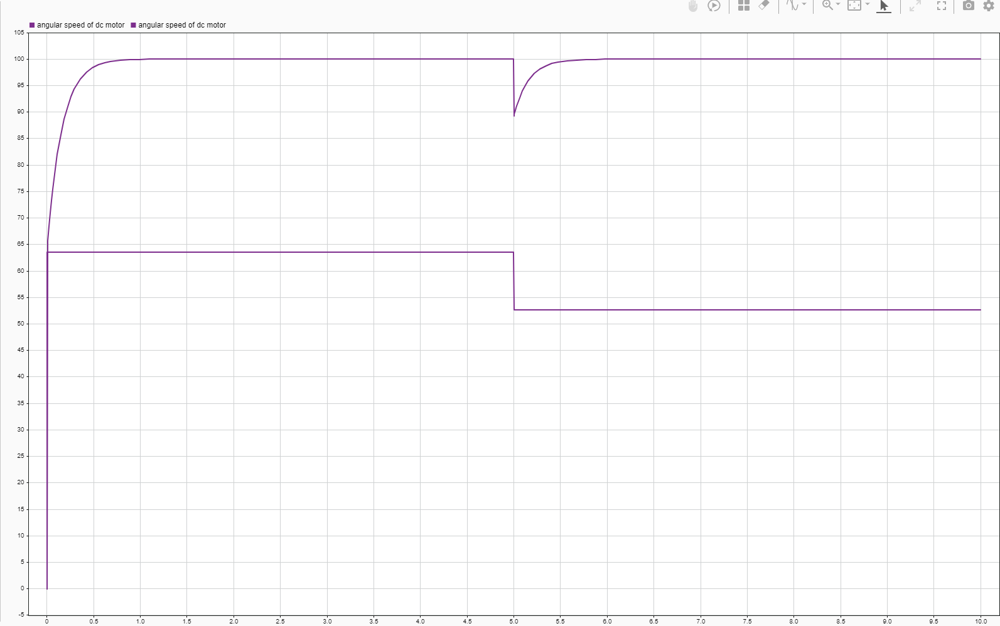
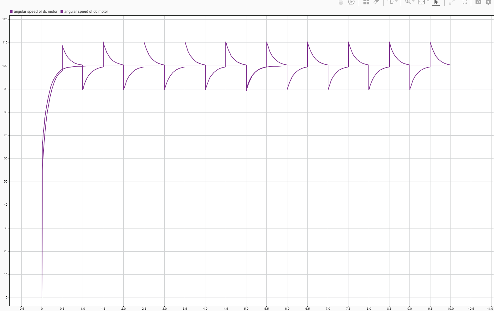

# PID Controlled DC-Motor Simulation Project

## Overview
This project implements and demonstrates a **PID (Proportional-Integral-Derivative) controlled DC motor**.
The goal is to show how each component in a PID controller works and how they improve system stability, response speed, and steady-state accuracy.

This project is intended as a **learning + demonstration project**, suitable for explaining control fundamentals to engineers and non-experts.

---

## What is a PID Controller? (Short Explanation)
A PID controller computes a control signal based on the **error** between a desired value (setpoint) and the measured output.

- **P (Proportional):** reacts to the current error
- **I (Integral):** reacts to accumulated past error
- **D (Derivative):** reacts to how fast the error is changing (predict the future)

Together, they allow the system to:
- Respond quickly
- Reduce overshoot
- Eliminate steady-state error
- Stay stable under disturbances

---

## System Description
The controller operates in a **closed-loop feedback system**:

1. A setpoint (DC motor speed) is defined
2. The system output (DC motor speed) is measured
3. Error = setpoint - output
4. The PID controller computes a control input (voltage for the DC motor)
5. The DC motor reponds and updates the output

This loop repeats continuously.

---

## Proportional (P) Control
The most basic form of control used in this project is **proportional (P) control**.

In P control, the input voltage to the DC motor is set **proportional to the error**, defined as:
error = target - measurement

This means:
- A **larger error** produces a **larger motor voltage**
- As the system output approaches the target, the voltage decreases

To protect the motor and hardware, the control signal is saturated, so the applied voltage is limited to a safe maximum value.

### Controllable Parameter
With P control only, there is one main tunable parameter:
- Proportional gain (Kp)
    This is the coefficient that scales the error into a voltage command.
    V = Kp * error

### Experiment Observations
To understand how the proportional gain affects system behavior, several experiments were conducted with different values of **Kp**.

The following trends were obsrved:
- Increasing **Kp** makes the system respond faster and reaches to steady state faster
- Higher **Kp** reduces the **steady-state error**
- However, larger **Kp** causes
    - Increased fluctuations in steady state
    - Reduced stability and oscillatory behavior

This shows a clear **trade-off**:
- Low Kp -> stable but slow, larger error
- High Kp -> fast response, smaller error, but more oscillation

### Limitation of P Control
Although proportional control improves response speed and reduces error, it cannot eliminate steady-state error completely.

This limitation motivates the introduction of **integral (I) control**, which accumulates error over time and compensates for remaining offset.

---

## Integral (I) control
Integral (I) control works by **accumulating the error over time**.
Its output is proportional to the **sum of past errors** since the system started.

This directly addresses a key limitation of proportional control:
**steady-state error.**

Even when the instantaneous error becomes small, the accumulated error continues to grow,
allowing the controller to push the system output closer to the target.

### Benefit: Eliminating Steady-State Error
Compared to P control alone:
- I control significantly **reduces or eliminates steady-state error**
- The output eventually reaches the target value more accurately
This makes integral control especially useful when precise steady-state tracking is required.

### Limitations: Slower Response
A key drawback of I control is its **slower response time**.

As the output approaches the target:
- The instantaneous error becomes smaller
- The rate of growth of the accumulated error decreases
- This causes the controller to react more slowly near steady state

This behavior is generally acceptable when:
- The load or output torque of the DC motor changes slowly (low-frequency disturbances)
- The system has enough time to respond

### High-Frequency Disturbance Test
To test this limitation, the motor torque input was changed from a **step function** to a **high-frequency pulse**.

Under this condition, the following behaviors were observed:
- Sharp changes in motor speed
- Increased fluctuations
- Oscillatory behavior in the output
These effects indicate **reduced stability** under fast-changing disturbances.

### Interpretation
The I control reacts based on **accumulated error**, not instantaneous changes.
As a result, it is **not well suited to handling rapid, high-frequency variations**.

To address these sharp changes and oscillations, the next step is to introduce **derivative (D) control**, which reacts to the **rate of change of error** and helps dampen fast variations.

## Derivative (D) Control

Derivative (D) control is implemented by taking the **time derivative of the error**.

This means:
- The **faster the error changes**, the **larger the D-control output**
- The controller reacts to how quickly the system is moving toward or away from the target

As a result, D control helps:
- Smooth rapid output changes
- Reduce oscillations
- Suppress sharp disturbances

### Pure Derivative Control Is Problematic
Using a pure derivative term alone is **not practical**.

When the error changes rapidly:
- Its derivative can become extremely large
- This causes the D-control output to "blow up"
- The resulting control signal becomes unstable and unrealistic
This issue is especially severe when the measurement contains **high-frequency noise**.

### Derivative Control with Low-Pass Filtering
To make D control usable, a **low-pass filter** is applied to the derivative term.

The filtered derivative is implemented using the following transfer function:
N*s/(s+N)

Where:
- N is the cutoff (threshold) frequency
- Low-frequency components pass through
- High-frequency components are attenuated

This filtering:
- Limit response to high-frequency components of the error
- Prevents excessive control output
- Produces more reasonable and stable behavior
- As a result, D control prevents excessive control action caused by sharp transitions and improves overall system stability.

### Role of the Laplace Transform
During this implementation, the importance of the Laplace transform in control systems became clear.

By taking the Laplace transform of both the input and output:
- Derivatives and integrals become **algebraic expressions**
- Differential equations turn into transfer functions
- System behavior becomes much easier to analyze and design
This provides a clearer mathematical understanding of how each control term affects the system.

### Tunable Parameters in D Control
There are **two tunable parameters** in the derivative controller:
1. Kd — derivative gain
2. N — cutoff frequency of the low-pass filter

### Effect of the Filter Cutoff Frequency (N)
With Kd fixed and varying N:

Larger N:
- Less filtering
- Smoother output
- Larger deviation from the target value

Smaller N:
- Stronger filtering
- Smaller overshoot
- Less smooth output

This shows a trade-off between smoothness and tracking accuracy.

### Effect of the Derivative Gain (Kd)
With N fixed and varying Kd:

Larger Kd:
- Stronger derivative action
- Smoother response
- Increased overshoot

Smaller Kd:
- Reduced overshoot
- Less smoothing
- More fluctuation in output
 
This reflects how much influence the derivative term has on the overall control behavior.

### Summary
The derivative term improves stability and smoothness, but only when:
- Proper filtering is applied
- Gains are carefully tuned

Overall, achieving good performance requires **balancing all PID coefficients** to ensure:
- Accurate tracking
- Smooth response
- Stable operation under disturbances

## Future improvement: anti-windup for I-control
Although the current PID controller achieves stable speed regulation under the tested conditions, the integral term may cause **integrator windup** in more demanding scenarios. Windup happens when the DC motor voltage saturates at its physical limit (e.g., max/min voltage), but the integrator continues accumulating error because the target has not been reached yet. Once the system leaves saturation, the stored integral value can drive a large overshoot and slow recovery, reducing stability and responsiveness.

A future improvement is to implement and test an anti-windup strategy, such as:
- **Integrator clamping (conditional integration)**: stop integrating when the control output is saturated and the integral would push further into saturation.

To validate this improvement, future tests can apply higher step torque that force voltage saturation, then compare settling time, overshoot, and recovery with and without anti-windup.